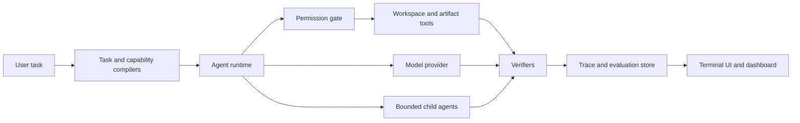

# Codetonomy Public

Codetonomy is a TypeScript control plane for coding agents. It turns a task into
a permissioned, observable run, records what the agent did, and verifies the
result before reporting success.

This repository is a clean academic showcase of the project. It contains the
runnable core, selected architecture records, tests, and third-party notices in
a fresh Git history. Internal experiments, audit working files, live-trial data,
local configuration, credentials, and reference checkouts are excluded.

## What it demonstrates

- Task and capability compilation before execution
- Workspace permissions with `ask`, `auto`, and `full-access` modes
- OpenAI, Anthropic, Gemini, DeepSeek, OpenRouter, and compatible provider routing
- Deterministic local runs that do not require an API key
- Bounded depth-one orchestration with explicit write claims
- Canonical JSONL traces, evaluation storage, verification, and repair
- Optional OCR, spreadsheet, presentation, backtesting, and memory workers
- A terminal interface and an authenticated local evaluation dashboard

## Architecture



The design keeps policy, execution, and verification separate. Provider SDKs
handle model-specific protocols, while Codetonomy owns permissions, tool
boundaries, orchestration limits, traces, and acceptance checks.

## Run the local demo

Requirements: Node.js 22.19+ and Corepack.

```bash
corepack pnpm install --frozen-lockfile
npm run build
node dist/Codetonomy.js run "Inspect this project and summarize its architecture"
```

The default provider is deterministic and local, so this path needs no API key.
To use a hosted model, run `node dist/Codetonomy.js setup` and follow the
interactive provider configuration.

Useful checks:

```bash
npm run check
npm test
```

## Suggested demonstration

1. Start the terminal UI with `node dist/Codetonomy.js`.
2. Show `/permissions ask` and submit a small workspace task.
3. Open `/runs` to inspect the trace and verification result.
4. Run `node dist/Codetonomy.js dashboard` to show aggregate evaluation data.

## Repository map

- `apps/cli`: terminal interface, setup, sessions, and commands
- `apps/dashboard`: local evaluation dashboard
- `packages/runtime`: agent execution and provider integration
- `packages/permissions`: permission policy and workspace boundaries
- `packages/orchestration`: bounded child-agent scheduling
- `packages/evals`: traces, metrics, exports, and evaluation storage
- `packages/verifiers`: result and artifact checks
- `services`: optional Python workers for OCR and generated artifacts
- `tests`: offline integration, security, and conformance coverage
- `docs/architecture`: design decisions and project boundaries

## Scope and attribution

This showcase is intended for academic review. The complete development
repository and its history remain private. Third-party dependencies and adapted
ideas are documented in `THIRD_PARTY_NOTICES.md`, `THIRD_PARTY_LICENSES.md`, and
`THIRD_PARTY_REUSE.yaml`.

No license is granted for reuse, redistribution, or modification unless the
copyright holder provides one separately.
